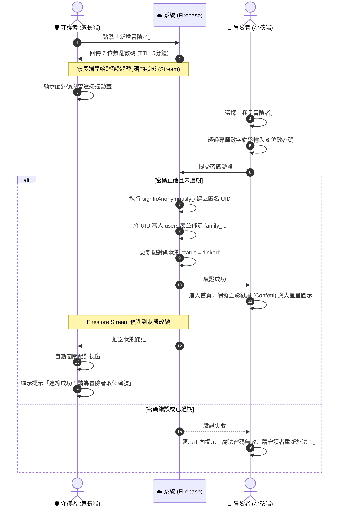
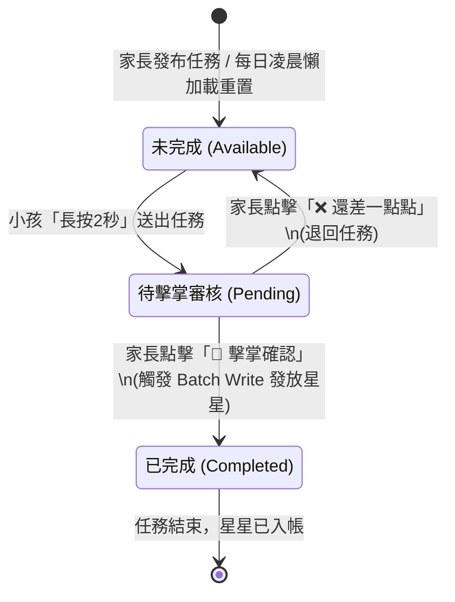
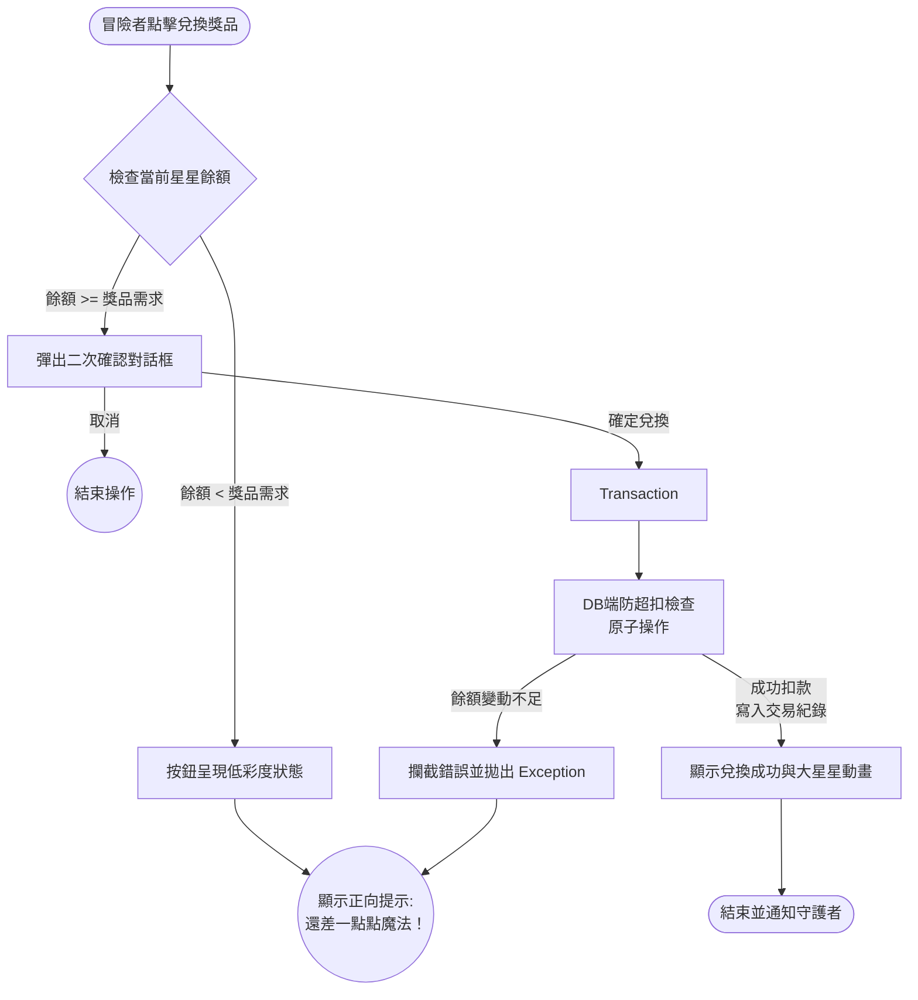
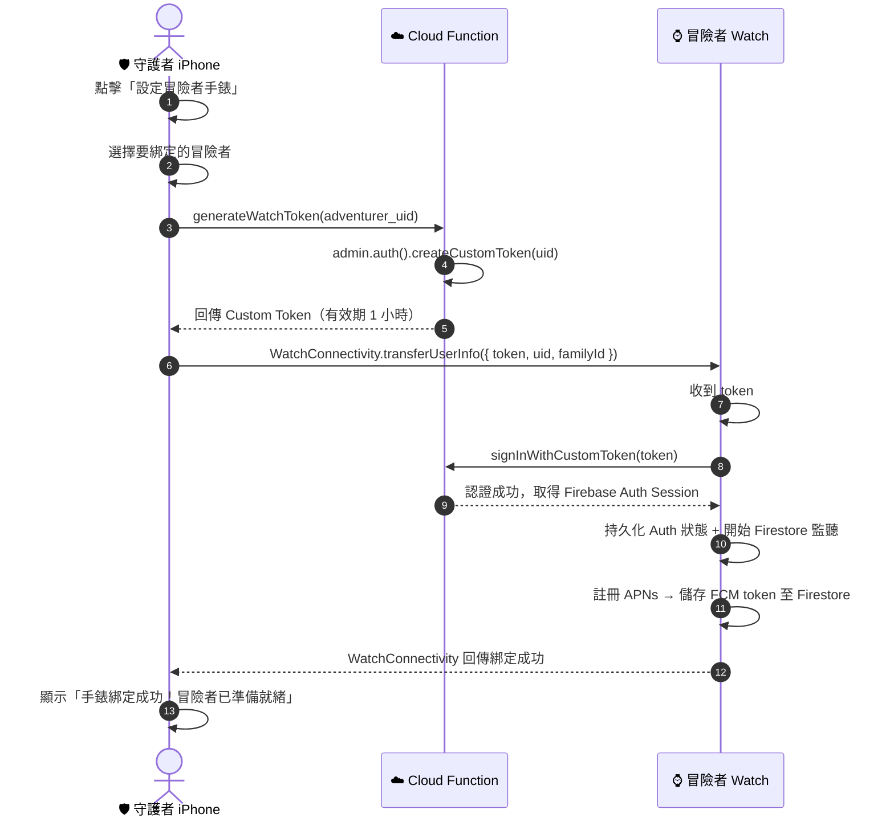
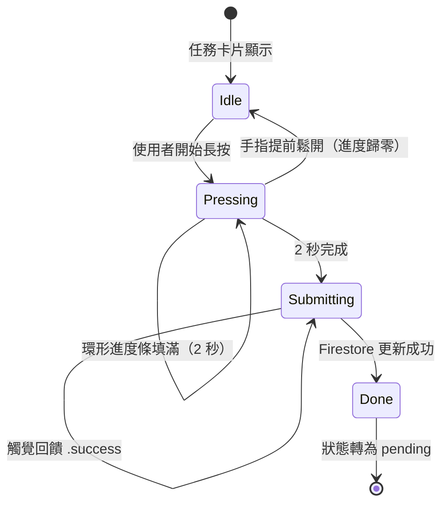
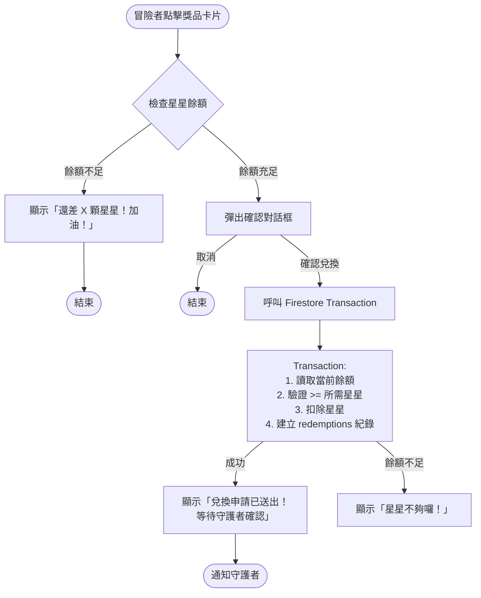

# 商業需求文件 (BRD)：我與我的小星星 (Me and My Little Stars) App

## 1. 產品願景與價值主張

本產品「我與我的小星星」旨在打造一款符合 UI/UX Pro Max 專業標準的家庭協作與教養工具。產品的核心目的，是**讓小朋友透過家長們設定的任務，在遊戲化的體驗中獲得滿滿的成就感**。我們將傳統且枯燥的家務清單轉化為生動的「冒險任務」，透過積極心理學中的正向強化（Positive Reinforcement）機制，激發兒童的內在動機並建立良好習慣，同時促進更和諧的親子互動 。

## 2. 目標受眾與雙角色體系

系統嚴格區分兩種使用者角色，確保權限隔離與互動的遊戲化體驗：

- **守護者 (Guardian / 家長)**：系統管理員。負責創建與發布任務、審核任務成果、自定義獎品庫內容以及設定兌換所需的星星數。
- **冒險者 (Adventurer / 兒童)**：系統執行者。負責查看每日的待辦冒險清單、回報任務進度、累積星星數量並以星星圖示顯示，並於系統中向父母發起獎品兌換。

## 3. 商業模式與收費策略

採用免費增值 (Freemium) 模式，結合「14 天免費試用期」來最大化初期用戶獲取與市場驗證速度：

- **14 天無限制試用 (Trial)**：新註冊的家庭公會在前 14 天內，可無限制地使用所有功能與任務發布數量，藉此建立使用習慣。
- **免費版 (Free Tier)**：14 天試用期結束後，系統將自動轉為免費版。守護者針對每位冒險者，最多只能設定 3 個活躍的任務 。
- **付費版 (Pro Tier)**：解除任務數量的限制（無限制任務數），並提供更進階的家庭數據回顧與自定義功能（金流串接預計於 Phase 2 實作）。

---

# 產品需求文件 (PRD) 與 MVP 規劃

## 1. 產品概述

本 PRD 旨在將上述的 BRD 轉化為開發團隊可執行的具體規格。為了在控制開發成本的前提下盡快測試市場反應，我們將產品生命週期劃分為 MVP (Phase 1) 與後續迭代 (Phase 2+)。

## 2. 核心模組與 MVP 範圍定義

### 模組一：設備安全綁定與帳號管理

- **MVP 範圍 (Phase 1)**：

  - 守護者透過 Email 與密碼註冊/登入。
  - 系統產生一組具備 5 分鐘時效性的「6 位數亂數碼」。
  - 冒險者端輸入亂數碼後，系統自動核發 Firebase 匿名帳號 (Anonymous Auth) 並綁定家庭，達成 COPPA 規範的隱私保護 。

### 模組二：全域錯誤處理與系統反饋

- **MVP 範圍 (Phase 1)**：

  - **後台觀測**：整合 Firebase Crashlytics，捕捉全域異常與自定義錯誤。
  - **正向 UX 文案**：網路斷線或操作失敗時，改用如「通訊水晶暫時失去能量，請檢查網路連線！」等符合冒險主題的文案。
  - **無網路阻擋機制**：離線時直接友善阻擋操作，不實作複雜的離線暫存邏輯。

### 模組三：任務設定與正向審核工作流

- **MVP 範圍 (Phase 1)**：

  - **任務類型**：支援「單次性任務」與「每日重複任務」。
  - **每日重置**：採用「延遲加載 (Lazy Loading)」策略，冒險者每日首次開啟 App 時才動態產生今日任務，降低伺服器負擔。
  - **審核流與資料一致性**：冒險者點擊「完成」進入待審核；守護者點擊「擊掌確認」時，後端透過 Firestore **批次寫入 (Batched Writes)** 同步更新任務狀態並增加星星。
  - **任務管理**：守護者可透過 Slidable 滑動操作編輯或刪除任務。編輯使用 WriteBatch 同步更新 blueprint 與 instance。已完成的任務僅允許刪除。
  - **歷史紀錄**：守護者與冒險者皆可瀏覽每週任務歷史。

### 模組四：獎勵兌換與星星消費機制

- **MVP 範圍 (Phase 1)**：

  - **寶藏庫自定義**：守護者可輸入獎品名稱、設定星星門檻，並選擇系統內建圖示。守護者可透過 Slidable 滑動操作編輯或刪除獎品。
  - **兌換申請與審核流**：冒險者點擊兌換時，系統透過 Firestore **交易機制 (Transactions)** 預扣星星並建立 `redemptions` 紀錄（狀態為 `pending`）。守護者審核後批准或拒絕（拒絕時退還星星）。
  - **防超扣機制**：使用 Transaction 確保星星餘額充足才扣除，絕對不產生負數。

### 模組五：系統基礎建設 (推播、設定與試用機制)

- **MVP 範圍 (Phase 1)**：

  - **推播通知 (FCM)**：當任務送出審核時，推送通知給守護者；當發放星星時，推送通知給冒險者；當獎勵兌換時，推送通知給守護者。
  - **14 天免費試用邏輯**：前端依據公會的 `created_at` 判斷，14 天內隱藏付費牆，超過 14 天則啟動 3 個任務的限制。
  - **設定頁與 COPPA 橡皮擦**：實作家長設定頁面，包含一個醒目的「一鍵刪除」按鈕，能觸發雲端函數徹底抹除兒童資料。
  - **多語系支援**：英文、簡體中文、繁體中文，守護者可於設定頁切換語言。

## 3. 核心使用者案例 (Use Cases) 與驗收標準 (AC)

### Usecase 1: 設備安全配對 (模組一)

- **UC 1.1: 守護者產生配對碼**

  - _AC1_: 點擊「新增冒險者」時，系統呼叫後端產生 6 位數亂數碼，時效為 5 分鐘。
  - _AC2_: 畫面顯示雷達掃描動畫，並啟動 Firestore Stream 監聽該配對碼狀態。
  - _AC3_: 若監聽到狀態變更為 `linked`，配對視窗自動關閉並顯示成功提示。
  - _AC4_: 配對成功後，守護者首頁必須即時反映新加入的冒險者（冒險者清單使用 Firestore Stream 而非一次性讀取）。
- **UC 1.2: 冒險者輸入配對碼**

  - _AC1_: 冒險者透過專屬數字鍵盤輸入 6 位數密碼。
  - _AC2_: 若密碼正確且未過期，系統核發匿名 UID 並將其關聯至該家庭群組，隨即進入首頁。
  - _AC3_: 若密碼錯誤或過期，顯示正向提示「魔法密碼無效，請守護者重新施法！」。
  - _AC4_: `watchAuthState()` 在 Firestore 使用者文件尚未建立時，不得發出 `null`（避免將使用者登出）。必須過濾 `doc.exists == false` 的快照，直到 Cloud Function 完成文件建立。
  - _AC5_: 建立任務時的冒險者選擇器，必須能即時反映新配對的冒險者（使用 Firestore Stream 或頁面進入時重新載入）。

### Usecase 2: 任務設定與審核 (模組三)

- **UC 2.1: 守護者發布新任務**

  - _AC1_: 可設定任務名稱、單次/每日重複，並透過步進器設定星星獎勵。多冒險者家庭時需選擇指派對象。
  - _AC2_: 若家長處於「免費版」狀態且該小孩已有 3 個活躍任務，發布按鈕反灰，並跳出解鎖 Pro 版提示。
  - _AC3_: 守護者可透過 Slidable 滑動操作編輯或刪除任務。編輯時使用 WriteBatch 同步更新 blueprint 與今日 instance。已完成的任務僅允許刪除（禁止編輯，因星星已發放）。
- **UC 2.2: 冒險者提交任務**

  - _AC1_: 冒險者需對任務按鈕進行「長按 2 秒」操作才可送出。
  - _AC2_: 送出後，任務狀態轉為 `pending`，畫面顯示「等待守護者與你擊掌！」，此階段不增加星星餘額。
- **UC 2.3: 守護者審核任務**

  - _AC1_: 守護者點擊「擊掌確認」時，系統使用 Batch Write 將任務狀態改為 `completed` 並增加對應星星數。
  - _AC2_: 守護者點擊「還差一點點」時，任務狀態退回 `available`。

### Usecase 3: 獎勵兌換與星星消費 (模組四)

- **UC 3.1: 守護者管理寶藏庫**

  - _AC1_: 守護者可新增獎品，輸入名稱、所需星星數並選擇圖示。
  - _AC2_: 守護者可編輯或刪除現有獎品（透過 Slidable 滑動操作）。
  - _AC3_: 守護者可將現有獎品狀態設為下架 (隱藏)。
- **UC 3.2: 冒險者申請兌換**

  - _AC1_: 若當前星星餘額小於獎品門檻，按鈕呈現低彩度；點擊時彈出提示「還差一點點魔法！再收集 X 顆星星就能解鎖囉！」。
  - _AC2_: 若星星充足，點擊兌換後彈出二次確認對話框。
  - _AC3_: 確認兌換時，後端執行 Transaction 預扣星星，建立 `redemptions` 紀錄（狀態為 `pending`），等待守護者審核。
- **UC 3.3: 守護者審核兌換申請**

  - _AC1_: 守護者在首頁看到待審核的兌換申請，可批准或拒絕。
  - _AC2_: 批准時，將 `redemptions` 狀態更新為 `approved` 並寫入 `transactions` 交易紀錄。
  - _AC3_: 拒絕時，將 `redemptions` 狀態更新為 `rejected` 並退還已預扣的星星。

### Usecase 4: 系統設定與合規 (模組五)

- **UC 4.1: 14 天試用期狀態判定**

  - _AC1_: 系統讀取家庭群組建立時間，若小於 14 天，無條件解除任務數量限制。
  - _AC2_: 第 15 天起，若未訂閱 Pro 版，新增任務時觸發數量檢查機制 (如 AC 2.1 所述)。
- **UC 4.2: COPPA 一鍵刪除資料**

  - _AC1_: 守護者在設定頁面點擊「刪除冒險者資料」，需輸入密碼進行二次身分驗證。
  - _AC2_: 驗證通過後，系統必須觸發後端程序，徹底且遞迴地刪除該冒險者在 `users`、`task_blueprints`、`task_instances`、`rewards`、`redemptions` 與 `transactions` 中的所有紀錄。

---

# 系統規格書 (Technical Specification) - MVP 階段

## 🎨 全域 UI/UX 視覺規範 (UI/UX Pro Max)

本產品設計目標為「活潑但具備專業感 (Playful but Professional)」，整體色彩系統如下：

- 🌟 **主核心色 - 琥珀星芒 (Amber-400, `#FBBF24`)**：用於星星圖示、累積星星總數與強調「獎勵」的區塊，傳達快樂、活力與價值感。
- ✅ **正向回饋色 - 翡翠綠 (Emerald-500, `#10B981`)**：用於家長端的「擊掌確認」按鈕與小孩端的「完成任務」狀態，極大化信任感與確認感 。
- ❌ **溫和除錯色 - 珊瑚粉 (Rose-400, `#FB7185`)**：**嚴禁使用純紅色 (Pure Red)**。當家長退回任務或網路斷線時使用此柔和色調，減輕視覺責備感 。
- 🏢 **溫暖基底色 - 暖石色 (Stone-800 `#292524` / Stone-50 `#FAF9F6`)**：應用於家長端的管理介面，搭配白色卡片，呈現溫暖且專業的家庭工具質感。

## 1. 關鍵 UI/UX 畫面動線與防呆設計

- **專屬數字鍵盤 (模組一)**：小孩輸入 6 位數密碼時，不使用系統預設鍵盤。實作客製化、色彩活潑且按鈕觸控區域大於 60pt 的專屬數字鍵盤，並加入觸覺回饋 (`HapticFeedback`)。
- **配對即時自動關閉 (模組一)**：家長生成配對碼後，利用 Firestore Stream 監聽狀態，小孩配對成功時，家長端視窗自動關閉並跳出慶祝文案。
- **長按防呆機制 (模組三)**：小孩提交任務時，採用「長按 2 秒 (Long-Press to Conquer)」按鈕，按住時呈現進度條填滿效果，防止誤觸。
- **設定頁與被遺忘權 (模組五)**：在守護者的「我的」頁面中，放置紅色的「刪除冒險者資料」按鈕。點擊後需輸入密碼二次確認，以符合 COPPA 規範。

## 2. 核心功能流程圖 (Mermaid Charts)

### 2.1 模組一：設備安全綁定流程 (Sequence Diagram)

展示守護者產生亂數碼、冒險者登入，以及 Firebase 進行即時狀態同步與匿名綁定的完整互動流。



### 2.2 模組三：任務狀態流轉圖 (State Diagram)

展示單一任務從發布、提交審核，到獲得星星或退回重做的狀態機邏輯。



### 2.3 模組四：獎勵兌換與防呆機制流程圖 (Flowchart)

展示小孩點擊兌換獎品時，系統確保不發生「超扣星星」的防呆與交易機制。



## 3. 核心資料庫架構與安全規則 (Database Schema & Security Rules)

### 3.1 Firestore 資料表結構 (Collections)

#### 📁 `families` (家庭公會)

```json
{
  "family_id": "fam_abc123",
  "parent_uids": ["parent_uid_001"],
  "subscription_tier": "trial", // 'trial', 'free', 'pro'
  "created_at": "2026-03-02T10:00:00Z" // 用於計算 14 天試用期
}
```

#### 📁 `users` (全域使用者)

包含家長與小孩。小孩帳號使用匿名登入生成，並儲存 FCM Token 以接收推播。

```json
{
  "uid": "child_anon_uid_999",
  "family_id": "fam_abc123",
  "role": "adventurer",
  "nickname": "勇敢的查理",
  "stars_balance": 120,
  "fcm_tokens": ["token_xyz..."], // 設備推播權杖
  "created_at": "2026-03-02T10:00:00Z"
}
```

#### 📁 `task_blueprints` (任務藍圖)

家長設定的任務模板，用於產生每日任務，並受限於 3 個任務的免費版限制（除非在試用期內）。

```json
{
  "blueprint_id": "bp_001",
  "family_id": "fam_abc123",
  "assignee_uid": "child_anon_uid_999",
  "title": "自己收拾玩具箱",
  "stars_reward": 5,
  "is_daily_recurring": true,
  "is_active": true
}
```

#### 📁 `task_instances` (每日任務實體)

```json
{
  "instance_id": "inst_bp001_20260302",
  "family_id": "fam_abc123",
  "blueprint_id": "bp_001",
  "assignee_uid": "child_anon_uid_999",
  "date_string": "2026-03-02",
  "status": "available", // available -> pending -> completed
  "updated_at": "2026-03-02T10:00:00Z"
}
```

#### 📁 `rewards` (寶藏庫)

存儲家長設定的可兌換獎品。

```json
{
  "reward_id": "rew_001",
  "family_id": "fam_abc123",
  "title": "看電視 30 分鐘",
  "stars_cost": 15,
  "icon_id": "tv_icon_01",
  "is_active": true
}
```

#### 📁 `transactions` (星星存摺/交易紀錄)

任何星星的增減都必須寫入此表，作為家長核銷與防弊的依據。此表與 `users` 的餘額更新必須綁定在同一個 Transaction 中以防超扣。

```json
{
  "transaction_id": "txn_999",
  "family_id": "fam_abc123",
  "user_uid": "child_anon_uid_999",
  "type": "spend", // 'earn' (獲得) 或 'spend' (消費)
  "amount": 15,
  "description": "兌換：看電視 30 分鐘",
  "created_at": "2026-03-02T10:30:00Z"
}
```

#### 📁 `redemptions` (兌換申請紀錄)

冒險者發起獎勵兌換後，建立一筆兌換申請紀錄，由守護者審核（批准或拒絕）。批准時扣除星星並寫入 `transactions`；拒絕時退還星星。

```json
{
  "redemption_id": "red_001",
  "family_id": "fam_abc123",
  "adventurer_uid": "child_anon_uid_999",
  "reward_id": "rew_001",
  "reward_title": "看電視 30 分鐘",
  "stars_cost": 15,
  "status": "pending", // 'pending' -> 'approved' | 'rejected'
  "created_at": "2026-03-02T10:30:00Z"
}
```

### 3.2 COPPA 合規與刪除邏輯 (Eraser Button)

為滿足 COPPA 規範，當家長點擊刪除時，不可僅依賴前端刪除。必須觸發 Firebase Cloud Function (如 `deleteChildData`)，由後端遞迴刪除該 `assignee_uid` 在 `users`, `task_blueprints`, `task_instances`, `rewards`, `redemptions` 與 `transactions` 中的所有紀錄，確保資料徹底抹除。

---

# 開發指引：基於 Clean Architecture 與 TDD 的原子化開發

## 執行摘要

在當前移動應用開發的生態系統中，構建一個既能滿足即時互動需求，又具備高度可維護性與擴展性的「我與我的小星星」應用程式，是一項涉及多重技術維度的挑戰。為了應對這些挑戰，並確保代碼庫在長期迭代中的穩定性，採用測試驅動開發（Test-Driven Development, TDD）結合潔淨架構（Clean Architecture）已Configuring modern software engineering best practices.

## 1. 架構基礎：Clean Architecture 在 Flutter 中的實踐

Clean Architecture 的核心價值在於其「相依性規則（Dependency Rule）」，即源碼的依賴方向只能指向內層。

### 1.1 分層架構

- **領域層 (Domain Layer)**：包含 Entities、Use Cases (如 `DistributeStarsUseCase`, `RedeemRewardUseCase`) 與 Repository Interfaces。這層完全不依賴 Flutter 或 Firebase 。
- **資料層 (Data Layer)**：包含 Models、Data Sources (調用 Firebase SDK) 與 Repository Implementations 。
- **表現層 (Presentation Layer)**：包含 BLoC / Cubit (狀態管理) 與 Widgets (UI 渲染)。

### 1.2 依賴注入 (Dependency Injection)

使用 `get_it` 搭配 `injectable` 註冊依賴關係。在測試環境中，注入 Mocks (`mocktail`) 或 Fakes (`fake_cloud_firestore`) 以隔離外部服務 。

## 2. 核心模組的技術實踐與 TDD 策略

針對前述的 MVP 模組，我們制定以下技術與測試實踐：

### 2.1 模組三：任務審核與 Batched Writes (批次寫入)

在處理守護者「擊掌確認」給予星星時，必須使用 Firestore 的 `WriteBatch`。

- **技術實作**：在 Repository 中，將「更新任務狀態為已完成」與「使用 `FieldValue.increment(stars)` 增加兒童星星餘額」放入同一個 batch 中提交。

### 2.2 模組四：獎勵兌換與 Transactions (交易機制)

扣除星星時為了防止並發點擊造成的負數餘額，必須使用 `Transaction` 。

- **技術實作**：在 Repository 中啟動 Transaction，先 `get()` 讀取兒童當前星星餘額，判斷若 `>=` 獎品所需星星，才執行 `update()` 扣款並寫入兌換紀錄；否則拋出 `InsufficientStarsException`。
- **TDD 測試重點**：編寫一個測試案例模擬餘額不足的情況，斷言 Repository 回傳了 `Left(InsufficientStarsFailure)` 而非執行扣款。

## 3. Git Commit 規範與 TDD 工作流

TDD 的核心節奏是「紅-綠-重構（Red-Green-Refactor）」。為了支持原子化開發並確保團隊協作的清晰度，我們嚴格採用擴展的語意化提交 (Semantic Commits) 搭配視覺化標籤 ：

- **🔴 (Red)**: 提交一個失敗的測試。此時產品代碼尚未完成，測試必然無法通過。

  _(例: `🔴 test(rewards): should return failure when stars are insufficient`)_
- **🟢 (Green)**: 提交使測試通過的最小實作代碼。此時該功能的所有單元測試必須為通過狀態。

  _(例: `🟢 feat(rewards): implement transaction logic for star deduction`)_
- **♻️ (Refactor)**: 在測試保護傘下，對剛通過的代碼進行結構優化與重構，且測試必須保持通過。

  _(例: `♻️ refactor(rewards): extract firestore paths to constants`)_

**原子提交準則**：每個 commit 只做一件事。嚴禁將功能 A 的測試代碼與功能 B 的實作代碼混雜在一起，確保版本歷史可隨時安全回滾 。

---

## Sprint 7 — 入門導覽與離線防護 (Onboarding Tutorial & Offline Guard)

### 1. 目標

完成 MVP Phase 1 最後兩項缺失功能：

- **入門導覽**：首次使用者透過 Spotlight 聚光燈效果逐步認識各頁面操作
- **離線阻擋**：無網路時友善阻擋寫入操作，不實作複雜的離線暫存邏輯

### 2. 模組六：入門導覽 (Onboarding Tutorial)

### 2.1 技術選型

**套件**：`tutorial_coach_mark`（Flutter 最熱門的 onboarding 套件，社群活躍、維護穩定）

**選型理由**：

- 支援圓形/方形 Spotlight 聚光燈效果
- 透過 `GlobalKey` 精確定位目標 widget
- 支援多步驟導覽序列與自訂 tooltip 樣式
- 內建 skip 功能

### 2.2 架構設計

```text
lib/
├── core/
│   └── services/
│       └── onboarding_service.dart        # SharedPreferences 封裝，管理各頁面導覽狀態
├── features/
│   ├── onboarding/
│   │   ├── data/
│   │   │   └── onboarding_keys.dart       # 各頁面 onboarding key 常數
│   │   └── presentation/
│   │       └── onboarding_builder.dart     # 可重用的 TutorialCoachMark 建構器
```

### 2.3 各頁面導覽流程

| 頁面             | SharedPreferences Key          | Spotlight 目標                                | 觸發條件       |
| ---------------- | ------------------------------ | --------------------------------------------- | -------------- |
| 守護者首頁       | `onboarding_guardian_home`   | 1. 新增冒險者按鈕 2. 任務卡片區域 3. 獎勵 Tab | 登入後首次進入 |
| 冒險者首頁       | `onboarding_adventurer_home` | 1. 任務清單 2. 長按送出提示 3. 星星餘額       | 配對後首次進入 |
| 建立任務頁       | `onboarding_create_task`     | 1. 冒險者選擇器 2. 星星步進器 3. 每日重複開關 | 首次進入       |
| 寶藏庫（守護者） | `onboarding_treasure_shop`   | 1. 新增獎品按鈕 2. 滑動操作提示               | 首次進入       |
| 寶藏庫（冒險者） | `onboarding_treasure_redeem` | 1. 獎品卡片 2. 兌換按鈕                       | 首次進入       |

### 2.4 實作細節

- **狀態持久化**：`OnboardingService`（injectable singleton）封裝 `SharedPreferences`
  - `Future<bool> hasSeenOnboarding(String key)` — 檢查是否已看過
  - `Future<void> markOnboardingSeen(String key)` — 標記已看過
  - `Future<void> resetAll()` — 重設所有導覽狀態（供設定頁「重新觀看導覽」使用）
- **觸發時機**：各頁面在 `initState()` 或 `BlocListener` callback 中檢查，未看過則觸發 `TutorialCoachMark.show()`
- **視覺設計**：tooltip 遵循 warm Stone 色系 + 冒險主題文案
- **跳過機制**：所有步驟提供「跳過」按鈕，跳過後標記為已看過（不再觸發）
- **重新觀看**：設定頁新增「重新觀看導覽」選項，呼叫 `OnboardingService.resetAll()`
- **觸覺回饋**：Spotlight 切換時觸發 `HapticFeedback.lightImpact()`

### 2.5 Best Practices

- 按頁面拆分導覽（非一次性全部展示），避免使用者資訊過載
- 漸進式揭露（Progressive Disclosure）：僅引導當前頁面的功能
- 可跳過且可重看
- 導覽文案配合多語系（EN、ZH、ZH_TW）

### 3. 模組二補充：離線阻擋機制 (Offline Guard)

### 3.1 技術選型

**套件**：`connectivity_plus`（已在 pubspec.yaml 中）

### 3.2 架構設計

```text
lib/
├── core/
│   └── services/
│       └── connectivity_service.dart      # Stream-based 連線狀態監控（injectable singleton）
│   └── widgets/
│       └── offline_banner.dart            # 全域離線狀態 banner
```

### 3.3 實作細節

#### ConnectivityService

- Injectable singleton（`@lazySingleton`）
- 暴露 `Stream<bool> isOnline`：基於 `connectivity_plus` 訂閱連線變化
- 提供同步方法 `bool get currentStatus`：供 Repository 層寫入前檢查

#### 全域離線 Banner（OfflineBanner）

- 以 `StreamBuilder<bool>` 監聽 `ConnectivityService.isOnline`
- 離線時：在頁面頂部顯示持久 Material Banner
  - 文案：「通訊水晶暫時失去能量，請檢查網路連線！」（已定義於 `NetworkFailure`）
  - 背景色：`AppColors.gentleError`（Rose-400，絕不使用純紅色）
- 恢復連線時：自動消失

#### Repository 層寫入前置防護

在所有寫入操作前檢查 `ConnectivityService.currentStatus`，離線時直接返回 `Left(NetworkFailure())`，不發出 Firestore 請求。

**需防護的操作清單**：

| 操作                   | 防護位置                                                |
| ---------------------- | ------------------------------------------------------- |
| 建立任務藍圖           | `TaskRepositoryImpl.createBlueprint()`                |
| 送出任務               | `TaskRepositoryImpl.submitTask()`                     |
| 核准 / 退回任務        | `TaskRepositoryImpl.approveTask()` / `rejectTask()` |
| 刪除任務               | `TaskRepositoryImpl.deleteTask()`                     |
| 建立 / 編輯 / 刪除獎品 | `RewardRepositoryImpl` 各 CRUD 方法                   |
| 申請 / 核准 / 拒絕兌換 | `RewardRepositoryImpl` 各兌換方法                     |
| 產生 / 驗證配對碼      | `PairingRepositoryImpl` 各方法                        |

**不需防護的操作**：

- 所有 read-only Stream（watchTodayTasks、watchRewards 等）：Firestore 內建 offline cache 自動處理

### 3.4 Best Practices

- 離線防護設於 Repository 層（單一職責，不散落在 UI 各處）
- 讀取 Stream 不阻擋（善用 Firestore offline cache）
- 僅阻擋寫入操作（符合需求：「離線時直接友善阻擋操作，不實作複雜的離線暫存邏輯」）
- 錯誤文案與模組二全域錯誤規範一致

### 4. 驗收標準 (Acceptance Criteria)

### 入門導覽

- **AC-7.1**：守護者首次進入首頁時看到 Spotlight 導覽；後續進入不再觸發
- **AC-7.2**：冒險者首次進入首頁時看到 Spotlight 導覽
- **AC-7.3**：設定頁「重新觀看導覽」可重設所有導覽狀態
- **AC-7.4**：跳過導覽後標記為已看過（不再重新觸發）
- **AC-7.9**：所有導覽 tooltip 文字支援 EN、ZH、ZH_TW

### 離線防護

- **AC-7.5**：失去連線後 2 秒內顯示離線 Banner
- **AC-7.6**：恢復連線後 Banner 自動消失
- **AC-7.7**：離線時寫入操作返回 `NetworkFailure`（不發出 Firestore 請求）
- **AC-7.8**：離線時讀取 Stream 仍可透過 Firestore cache 正常運作

### 5. 子任務與 Commit 計畫

```text
# Phase A: Onboarding
A1. 新增 tutorial_coach_mark 依賴
A2. 建立 OnboardingService（SharedPreferences 封裝）
A3. 建立 OnboardingBuilder（可重用 TutorialCoachMark 設定）
A4. 守護者首頁加入導覽
A5. 冒險者首頁加入導覽
A6. 建立任務頁加入導覽
A7. 寶藏庫加入導覽（守護者 + 冒險者）
A8. 設定頁新增「重新觀看導覽」選項
A9. 新增 OnboardingService 測試
A10. 新增所有導覽 tooltip 多語系字串（EN、ZH、ZH_TW）

# Phase B: Offline Guard
B1. 建立 ConnectivityService（singleton）
B2. 建立 OfflineBanner widget
B3. 整合 OfflineBanner 至 app scaffold
B4. TaskRepositoryImpl 加入寫入前置防護
B5. RewardRepositoryImpl 加入寫入前置防護
B6. PairingRepositoryImpl 加入寫入前置防護
B7. 新增 ConnectivityService 與 Repository guard 測試

# Phase C: Documentation
C1. 更新 CHANGELOG.md
C2. 更新 AGENTS.md Sprint 狀態
C3. 產生手動測試清單（docs/sprint7_manual_test_checklist.md）
```

---

## Sprint 8 — Apple Watch 冒險者端 (watchOS Adventurer App)

### 1. Sprint 8 目標

讓沒有手機的冒險者（小朋友）透過 Apple Watch 獨立使用核心功能：

- 接收守護者指派的新任務
- 查看今日任務清單並長按送出完成
- 查看星星餘額
- 瀏覽寶藏庫並申請獎勵兌換
- 接收推播通知（新任務、任務核准、星星獲得、兌換結果）
- 錶面 Complication 快速查看星星數與待完成任務數
- 通知內直接送出任務（Notification Action）

### 2. 技術選型與平台需求

| 項目 | 選型 | 理由 |
| --- | --- | --- |
| UI 框架 | **SwiftUI** | watchOS 強制要求，Apple 官方最佳實踐 |
| 最低版本 | **watchOS 10+** | 支援 NavigationSplitView、WidgetKit Complication、穩定獨立 App 能力（涵蓋 Apple Watch Series 4+） |
| App 類型 | **獨立式 watchOS App** | 支援 Apple Watch Family Setup，小朋友無需持有 iPhone |
| Firebase | **Firebase iOS SDK (SPM)** | 10.4+ 起支援 watchOS target（Auth + Firestore） |
| 認證傳遞 | **WatchConnectivity** | 守護者 iPhone → 冒險者 Watch 傳遞 Firebase Custom Token |
| 推播 | **APNs 原生** | watchOS 獨立接收推播，FCM token 註冊在 Watch 端 |
| 狀態管理 | **@Observable (Observation framework)** | watchOS 10+ 原生，取代 ObservableObject，效能更優 |

### 3. 模組七：Watch 認證與配對 (Watch Auth & Pairing)

#### 3.1 背景：Apple Watch Family Setup

Apple Watch Family Setup 允許家長透過自己的 iPhone 為沒有 iPhone 的小朋友設定 Apple Watch。在此模式下：

- 手錶與家長 iPhone 配對，但為小朋友建立獨立的 Apple ID（兒童帳號）
- 手錶可透過 WiFi 或行動數據獨立上網
- WatchConnectivity 在家長 iPhone 與小朋友 Watch 之間可用

#### 3.2 認證流程（Sequence Diagram）



#### 3.3 Watch 認證實作細節

**iPhone 端（Flutter + Platform Channel）**：

- 新增 `WatchConnectivityChannel`（MethodChannel）供 Flutter 呼叫
- iOS native 端實作 `WCSessionDelegate`，處理 `transferUserInfo` 傳送與回調
- Flutter UI：設定頁新增「設定冒險者手錶」按鈕，選擇冒險者後觸發 token 產生與傳送

**Watch 端（SwiftUI）**：

- `WatchConnectivityService`：實作 `WCSessionDelegate`，監聽 `didReceiveUserInfo`
- 收到 token 後呼叫 `Auth.auth().signIn(withCustomToken:)`
- Auth 狀態持久化：Firebase Auth 自動管理 Keychain token refresh
- 認證完成後啟動 Firestore listeners 與 APNs 註冊

**Cloud Function**：

- `generateWatchToken`：Callable Function，驗證呼叫者為守護者身分，產生指定冒險者 UID 的 Custom Token

#### 3.4 斷線重連與 Token 過期處理

- Firebase Auth Custom Token 有效期 1 小時，但認證後 Firebase SDK 會自動 refresh session
- 若 Watch 長時間離線後重連，Firebase SDK 自動處理 token refresh
- 若 session 完全失效（極罕見），Watch 顯示「請守護者重新連結手錶」提示

### 4. 模組八：Watch 任務系統 (Watch Task System)

#### 4.1 今日任務清單

**資料來源**：Firestore `task_instances` collection，與 Flutter App 共用相同資料

**監聽查詢**：

```swift
db.collection("task_instances")
  .whereField("family_id", isEqualTo: familyId)
  .whereField("assignee_uid", isEqualTo: uid)
  .whereField("date_string", isEqualTo: todayString)
  .addSnapshotListener { snapshot, error in ... }
```

**UI 呈現（TaskListView）**：

- 垂直捲動清單，Digital Crown 滾動
- 每張任務卡片顯示：任務名稱 + 星星獎勵數 + 狀態圖示
- 狀態視覺：
  - `available`：Emerald 圓點 + 可互動
  - `pending`：Amber 沙漏圖示 +「等待擊掌！」文字
  - `completed`：Emerald 勾勾 + 星星動畫

#### 4.2 長按送出任務

與 iOS App 一致的「長按 2 秒 (Long-Press to Conquer)」互動模式：



**實作細節**：

- 環形進度動畫圍繞任務卡片（`ProgressView` circular style）
- 觸覺回饋序列：按下 `.start` → 進度中每 0.5 秒 `.click` → 完成 `.success`
- Firestore 寫入：更新 `task_instances` status → `pending`
- 送出後卡片自動轉為「等待擊掌！」狀態

#### 4.3 任務狀態即時同步

- Firestore `snapshotListener` 確保 Watch 與 iPhone App 即時同步
- 守護者在 iPhone 核准任務後，Watch 即時收到狀態更新（completed + 星星動畫）
- 守護者退回任務時，Watch 即時顯示「再試一次！」並恢復為 available

### 5. 模組九：Watch 星星與獎勵 (Watch Stars & Rewards)

#### 5.1 星星餘額顯示

**資料來源**：Firestore `users` document，監聽 `stars_balance` 欄位

**UI 呈現（StarBalanceView）**：

- 位於畫面頂部，大字體顯示星星數 + Amber 星星圖示
- 星星增加時播放微型慶祝動畫（數字跳動 + 觸覺 `.success`）
- 星星減少時（兌換扣除）顯示消費動畫

#### 5.2 寶藏庫瀏覽

**資料來源**：Firestore `rewards` collection，篩選 `is_active == true`

**監聽查詢**：

```swift
db.collection("rewards")
  .whereField("family_id", isEqualTo: familyId)
  .whereField("is_active", isEqualTo: true)
  .addSnapshotListener { snapshot, error in ... }
```

**UI 呈現（RewardListView）**：

- 垂直捲動清單，每張獎品卡片顯示：獎品名稱 + 所需星星數 + 圖示
- 星星充足時：卡片全彩，可點擊兌換
- 星星不足時：卡片低彩度，點擊顯示「還差 X 顆星星！」

#### 5.3 獎勵兌換申請



**實作細節**：

- 兌換確認使用 watchOS 原生 `.confirmationDialog`
- Transaction 邏輯與 Flutter App 完全一致（防超扣機制）
- 兌換成功後觸覺回饋 `.success` + 星星扣除動畫

#### 5.4 兌換狀態追蹤

- 監聽 `redemptions` collection，顯示待審核 / 已核准 / 已拒絕狀態
- 守護者核准時：Watch 顯示慶祝提示 + 觸覺 `.success`
- 守護者拒絕時：Watch 顯示「星星已退還！」+ 星星餘額自動更新

### 6. 模組十：Watch 推播通知 (Watch Push Notifications)

#### 6.1 通知類型

| 觸發事件 | 通知標題 | 通知內容 | 觸覺回饋 |
| --- | --- | --- | --- |
| 守護者新增任務 | 📋 新冒險任務！ | 「{任務名稱}」等你來挑戰！ | `.default` |
| 守護者核准任務 | ⭐ 擊掌成功！ | 你獲得了 {N} 顆星星！ | `.success` |
| 守護者退回任務 | 💪 再試一次！ | 「{任務名稱}」還差一點點，加油！ | `.notification` |
| 兌換申請核准 | 🎁 獎品到手！ | 「{獎品名稱}」兌換成功！ | `.success` |
| 兌換申請拒絕 | 🔄 星星已退還 | 「{獎品名稱}」兌換未通過，星星已歸還 | `.notification` |

#### 6.2 FCM Token 註冊

- Watch App 啟動時註冊 APNs，取得 device token
- 透過 Firebase Messaging SDK 轉換為 FCM token
- 儲存至 Firestore `users/{uid}/watch_fcm_tokens` 欄位（與既有 `fcm_tokens` 分開管理）

#### 6.3 Cloud Functions 擴充

既有 Cloud Functions（`onTaskSubmitted`、`onTaskApproved`、`onRedemptionCreated`）需擴充：

- 送出通知時同時檢查 `fcm_tokens`（手機）與 `watch_fcm_tokens`（手錶）
- 分別發送，避免單一 token 失效影響另一裝置
- Invalid token 自動清理邏輯同樣套用於 `watch_fcm_tokens`

#### 6.4 Notification Action — 通知內送出任務

- **適用場景**：收到「新冒險任務」通知時，提供「長按完成」Action Button
- **技術實作**：watchOS `UNNotificationCategory` 註冊自訂 Action
- **安全機制**：Action 觸發後仍需確認對話框，避免誤觸（手錶螢幕小，容易誤按）
- **流程**：通知 Action → 確認對話框 → Firestore 更新 → 觸覺回饋

### 7. 模組十一：Complication 錶面小工具

#### 7.1 Complication 類型

| 位置 | 顯示內容 | 更新頻率 |
| --- | --- | --- |
| **Circular** | 星星數字 + ⭐ 圖示 | Firestore listener 即時更新 |
| **Rectangular** | 「{N} 個任務等你挑戰」或「今日任務已完成！」 | Firestore listener 即時更新 |
| **Corner** | 星星數字 | 同上 |

#### 7.2 技術實作

- 使用 **WidgetKit** 建構 Complication（watchOS 10+ 標準方式）
- `TimelineProvider` 透過 App Group 共享資料（Firestore listener → UserDefaults in App Group → Widget reload）
- 資料流：Firestore snapshot → `WatchDataStore`（App Group shared UserDefaults）→ `WidgetCenter.shared.reloadAllTimelines()`

### 8. watchOS UI/UX 設計規範

#### 8.1 導航架構

```text
⌚ Watch App
├── TabView (頂層分頁，Digital Crown 切換)
│   ├── Tab 1: 📋 今日任務 (TaskListView)
│   │   └── 任務卡片 → 長按送出
│   ├── Tab 2: ⭐ 星星 & 寶藏 (StarRewardView)
│   │   ├── 星星餘額 (頂部)
│   │   └── 獎品清單 → 點擊兌換
│   └── Tab 3: ⚙️ 設定 (WatchSettingsView)
│       └── 關於 / 重新連結
```

#### 8.2 視覺設計原則

| 原則 | 實作 |
| --- | --- |
| **Glanceable（一眼可讀）** | 任務卡片極簡：名稱 + 星星數 + 狀態圖示，不超過 2 行 |
| **單手操作** | Digital Crown 滾動、長按手勢送出、點擊兌換 |
| **色彩延續** | Stone-800 `#292524` 背景 + Amber `#FBBF24` 星星 + Emerald `#10B981` 完成 + Rose `#FB7185` 退回 |
| **字體** | SF Rounded（watchOS 系統預設，活潑且符合兒童風格） |
| **觸覺回饋** | 所有互動皆觸發對應觸覺（`.start` / `.click` / `.success` / `.failure`） |
| **最小觸控區域** | 所有可點擊元素 ≥ 44pt（Apple HIG 規範） |
| **深色優先** | watchOS 以深色為主，搭配 Stone-800 基底色無縫融合 |

#### 8.3 動畫與回饋

- **任務完成**：星星從任務卡片飛入頂部餘額（微型 particle 動畫）
- **獎勵兌換**：星星從餘額飛出 + 數字遞減動畫
- **新任務出現**：卡片從底部滑入 + 觸覺 `.notification`
- **所有動畫時長**：≤ 0.5 秒（watchOS 最佳實踐，避免延遲感）

### 9. Firestore Schema 變更

#### `users` collection 新增欄位

```json
{
  "uid": "child_anon_uid_999",
  "watch_fcm_tokens": ["watch_token_xyz..."],
  "has_watch": true,
  "watch_paired_at": "2026-03-15T10:00:00Z"
}
```

#### Firestore Security Rules 新增

```javascript
// Watch FCM token 僅允許自己的 UID 寫入
match /users/{userId} {
  allow update: if request.auth.uid == userId
    && request.resource.data.diff(resource.data).affectedKeys()
       .hasOnly(['watch_fcm_tokens', 'has_watch', 'watch_paired_at']);
}
```

### 10. Cloud Function 變更

#### 新增：`generateWatchToken`

```text
觸發方式：Callable Function
輸入：{ adventurer_uid: string }
驗證：呼叫者必須為同家庭的守護者
輸出：{ custom_token: string }（有效期 1 小時）
```

#### 修改：既有通知函數

- `onTaskSubmitted`：同時發送至 `fcm_tokens` + `watch_fcm_tokens`
- `onTaskApproved`：同時發送至 `fcm_tokens` + `watch_fcm_tokens`
- `onRedemptionCreated`：同時發送至 `fcm_tokens` + `watch_fcm_tokens`
- 新增：`onRedemptionApproved` / `onRedemptionRejected` → 發送至冒險者的 `watch_fcm_tokens`

### 11. iPhone 端變更（Flutter App）

#### 11.1 設定頁新增

- 「設定冒險者手錶」按鈕（僅守護者可見）
- 點擊後選擇冒險者 → 觸發 `generateWatchToken` → WatchConnectivity 傳送
- 顯示配對狀態（已配對 / 未配對）

#### 11.2 Platform Channel 新增

```dart
// lib/core/services/watch_connectivity_channel.dart
class WatchConnectivityChannel {
  static const _channel = MethodChannel('com.mylittlestar/watch');

  /// 檢查 Watch 是否可達
  Future<bool> isWatchReachable();

  /// 傳送認證 token 至 Watch
  Future<bool> sendAuthToken({
    required String token,
    required String uid,
    required String familyId,
  });

  /// 監聽 Watch 配對狀態回調
  Stream<WatchPairingStatus> watchPairingStatus();
}
```

#### 11.3 iOS Native 新增

```text
ios/Runner/WatchConnectivityHandler.swift
- WCSessionDelegate 實作
- MethodChannel 註冊（在 AppDelegate 中）
- transferUserInfo 傳送與接收回調
```

### 12. 驗收標準 (Acceptance Criteria)

#### 認證與配對

- **AC-8.1**：守護者可在設定頁選擇冒險者並觸發 Watch 配對流程
- **AC-8.2**：Watch 收到 Custom Token 後自動完成 Firebase 認證，進入主畫面
- **AC-8.3**：Watch 認證狀態持久化，App 重啟後無需重新配對
- **AC-8.4**：認證失敗時 Watch 顯示正向提示「請守護者重新連結手錶」

#### 任務系統

- **AC-8.5**：Watch 即時顯示今日任務清單（與 iPhone App 同步）
- **AC-8.6**：冒險者可透過長按 2 秒送出任務，送出後狀態即時轉為 pending
- **AC-8.7**：守護者在 iPhone 核准/退回任務後，Watch 即時反映狀態變更
- **AC-8.8**：所有任務操作皆有對應觸覺回饋

#### 星星與獎勵

- **AC-8.9**：Watch 即時顯示正確的星星餘額
- **AC-8.10**：Watch 可瀏覽寶藏庫中所有 active 獎品
- **AC-8.11**：星星充足時可申請兌換，使用 Firestore Transaction 防超扣
- **AC-8.12**：星星不足時點擊獎品顯示鼓勵提示
- **AC-8.13**：兌換結果（核准/拒絕）即時反映在 Watch 上

#### 推播通知

- **AC-8.14**：Watch 獨立接收所有類型推播通知（不依賴 iPhone）
- **AC-8.15**：「新任務」通知包含 Notification Action 可直接送出任務
- **AC-8.16**：FCM token 正確儲存至 `watch_fcm_tokens`，失效時自動清理

#### Complication

- **AC-8.17**：Circular Complication 正確顯示星星數
- **AC-8.18**：Rectangular Complication 正確顯示待完成任務數/完成狀態
- **AC-8.19**：資料變更時 Complication 即時更新

### 13. 子任務與 Commit 計畫

```text
# Phase A: 基礎建設
A1. Xcode 新增 watchOS target + SPM 整合 Firebase (Auth + Firestore + Messaging)
A2. Cloud Function: generateWatchToken (Callable Function)
A3. iOS native: WatchConnectivityHandler (WCSessionDelegate + MethodChannel)
A4. Flutter: WatchConnectivityChannel (Platform Channel 封裝)
A5. Watch: WatchConnectivityService (接收 token + Firebase signIn)
A6. Watch: Auth 狀態持久化 + 斷線重連處理

# Phase B: 任務系統
B1. Watch: WatchFirestoreService (Firestore listener 封裝)
B2. Watch: TaskListView + TaskRowView (今日任務清單 UI)
B3. Watch: 長按送出任務互動（2 秒 + 環形進度 + 觸覺回饋）
B4. Watch: 任務狀態即時同步（available / pending / completed 視覺切換）

# Phase C: 星星與獎勵
C1. Watch: StarBalanceView (星星餘額 + 即時監聽)
C2. Watch: RewardListView (寶藏庫瀏覽 + 餘額不足提示)
C3. Watch: 獎勵兌換申請 (Firestore Transaction + 確認對話框)
C4. Watch: 兌換狀態追蹤 (redemptions 監聽)

# Phase D: 推播通知
D1. Watch: APNs 註冊 + FCM token 儲存
D2. Cloud Functions 擴充：同時發送至手機 + 手錶 tokens
D3. Watch: Notification Action — 通知內送出任務
D4. Cloud Functions 新增：onRedemptionApproved / onRedemptionRejected

# Phase E: Complication
E1. Watch: App Group 設定 + WatchDataStore (共享 UserDefaults)
E2. Watch: WidgetKit Complication (Circular + Rectangular + Corner)
E3. Watch: TimelineProvider + 資料同步

# Phase F: iPhone 端整合
F1. Flutter: 設定頁新增「設定冒險者手錶」UI
F2. Flutter: 冒險者選擇器 + 配對狀態顯示
F3. Firestore Security Rules 更新

# Phase G: 測試與文件
G1. WatchConnectivityService 單元測試
G2. WatchFirestoreService 單元測試
G3. Cloud Function generateWatchToken 測試
G4. 更新 CHANGELOG.md / AGENTS.md
G5. 產生手動測試清單（docs/sprint8_manual_test_checklist.md）
```
