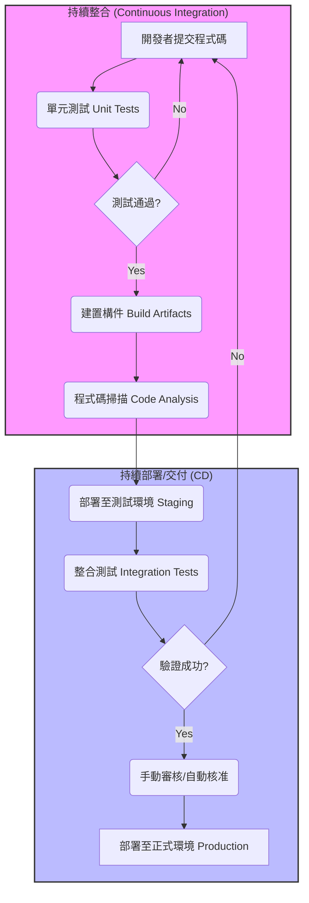

## 什麼是 DevOps
DevOps 只是個方法論，但實踐上是確非常彈性的一思維。目的是為了==打破傳統開發人員與運維中間的鴻溝==

---
## CICD

```mermaid
graph TD
    subgraph CI ["持續整合 (Continuous Integration)"]
        A[開發者提交程式碼] --> B(單元測試 Unit Tests)
        B --> C{測試通過?}
        C -- No --> A
        C -- Yes --> D(建置構件 Build Artifacts)
        D --> E(程式碼掃描 Code Analysis)
    end

    subgraph CD ["持續部署/交付 (CD)"]
        E --> F(部署至測試環境 Staging)
        F --> G(整合測試 Integration Tests)
        G --> H{驗證成功?}
        H -- No --> A
        H -- Yes --> I(手動審核/自動核准)
        I --> J[部署至正式環境 Production]
    end

    style CI fill:#f9f,stroke:#333,stroke-width:2px
    style CD fill:#bbf,stroke:#333,stroke-width:2px
```

