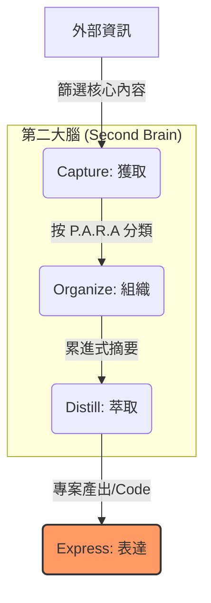

## 學習框架解析

C.O.D.E. 是一個線性的資訊處理流程，重點在於**減少認知負荷**並**增加產出效率**。

### 1. Capture (獲取) —— 留住產生共鳴的資訊

不要試圖記住所有細節，只獲取「對你有啟發」或「未來可能有價值」的片段。

- **技術應用**：存儲 GitHub Readme 關鍵段落、StackOverflow 的核心解決方案、或是 AWS/GCP 的架構圖。
    
- **關鍵標準**：是否具有啟發性？是否具有跨專案的參考價值？
    

### 2. Organize (組織) —— 為「行動」而設計

不按類別編排，而是按**專案（Actionability）**編排。這裡通常搭配 **P.A.R.A.** 系統：

- **Projects (專案)**：正在進行的任務（如：重構 NestJS API）。
    
- **Areas (領域)**：長期責任（如：DevOps 基礎設施維護）。
    
- **Resources (資源)**：感興趣的主題（如：Rust 性能調優）。
    
- **Archives (封存)**：已完成或暫停的項目。
    

### 3. Distill (萃取) —— 尋找核心精髓

利用「累進式摘要」（Progressive Summarization）將大量資訊濃縮成一眼就能看懂的重點。

- **技術應用**：將長達 50 頁的 Kubernetes 官方文件，濃縮成幾行關鍵的 `kubectl` 指令或 YAML 配置邏輯。
    
- **目標**：讓未來的你在 30 秒內找回該主題的核心脈絡。
    

### 4. Express (產出) —— 將知識轉化為成果

所有的學習若不轉化為產出，就是死知識。

- **技術應用**：發布一個模組化的 Rust Crate、撰寫一份技術規格文件、或是建立一個自動化的 CI/CD Template。

---
## 學習工作流可視化



---
## 實踐範例：以學習 "Rust Memory Safety" 為例

若你正在應用 C.O.D.E. 框架學習 Rust，其結構化資料如下：

```json
{
  "Framework": "C.O.D.E.",
  "Topic": "Rust Ownership & Borrowing",
  "Execution": {
    "Capture": [
      "The Rust Programming Language Ch.4 highlights",
      "Example of memory leak in C++ vs Rust solution snippet",
      "Diagram of Stack vs Heap allocation"
    ],
    "Organize": {
      "System": "PARA",
      "Location": "Resources/Rust_Internal",
      "Linked_Project": "Refactor_Legacy_API_to_Rust"
    },
    "Distill": {
      "Method": "Progressive Summarization",
      "Key_Insight": "Ownership ensures memory safety at compile time without GC via Move/Copy/Borrow semantics."
    },
    "Express": [
      "Implement a thread-safe Shared Buffer in Rust",
      "Update team Internal Wiki on Rust memory management"
    ]
  }
}
```